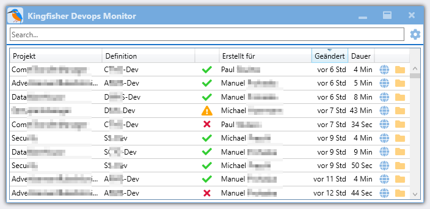

# Kingfisher Build Monitor
A build monitor for Azure DevOps Server, written with WPF for dotnet core 3.0.

## What is it?
This is a desktop application which monitors a Team Foundation Server and displays a list of recent builds.
The builds can be sorted and filtered, and you can open builds on the TFS's web UI, and open the drop location of builds. It can run in the system tray as an icon and automatically start when windows starts.

## Why do I need this at all?
So, you have your TFS running with a some Team Projects on it. IMHO it's very cumbersome to monitor the builds and releases of all Team Projects in once place, since the web ui of TFS will only show one Team Project.

## What does it look like?

Translations for english and german are available.

## Where does the name come from?
The Kingfisher ("Eisvogel" in german) is a beautiful bird that lives at rivers and catches fish. It's orange and azure, so it's related to Azure DevOps :-)

# Technical stuff
This is a rewrite of https://github.com/praschl/TeamBuildMonitor which used the WCF api of TFS. The new REST api is much more
flexible, easier to use and has much more functionality, which will let me create more exciting features.

Currently this is targeting the API version 2.3 for TFS, which means, it will work with TFS 2017.
